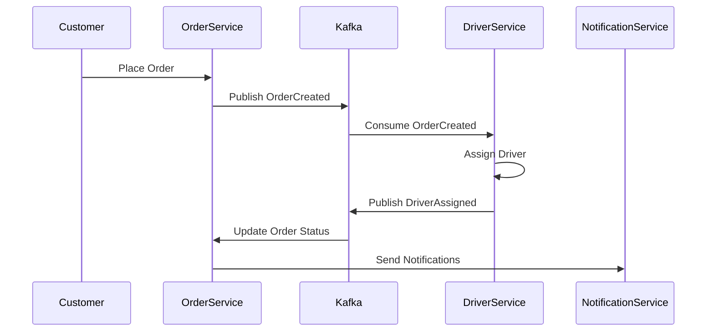
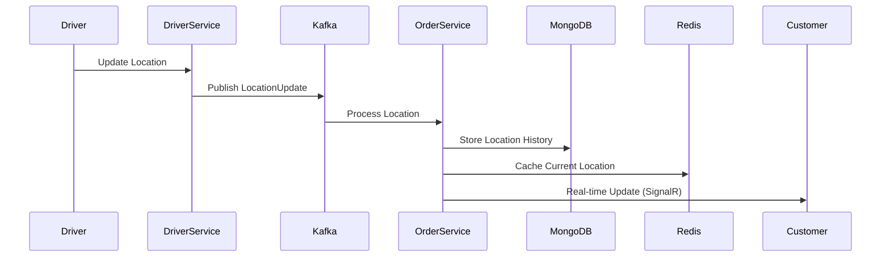

# Order Tracking System

A microservices-based real-time order tracking system built with .NET 9, implementing CQRS and DDD patterns. The system provides real-time order tracking, driver assignment, and notifications for both customers and drivers.

## 🌟 Features

### Core Functionality
- Real-time order tracking with live map updates
- Automated driver assignment with retry mechanism
- Order status management and updates
- Location history tracking
- Push notifications for order updates
- Email notifications for important events

### Technical Features
- CQRS (Command Query Responsibility Segregation) architecture
- Domain-Driven Design (DDD) implementation
- Event-driven architecture using Kafka
- Real-time updates using SignalR
- Distributed caching with Redis
- Polyglot persistence (PostgreSQL + MongoDB)
- Microservices architecture

## 🏗️ Architecture

### Microservices
- **Order Service**: Handles order management and tracking
- **Driver Service**: Manages driver assignments and location updates
- **Customer Service**: Handles customer-facing operations
- **Notification Service**: Manages push notifications and emails

### Data Stores
- **PostgreSQL**: Primary database for order and customer data
- **MongoDB**: Stores location history and tracking data
- **Redis**: Caches frequently accessed data and driver locations

### Message Broker
- **Kafka**: Handles inter-service communication and event processing

## 💾 Data Flow

### Order Creation and Assignment


### Real-time Tracking


## 🛠️ Technology Stack

### Backend
- **.NET 9**: Core framework
- **ASP.NET Core**: Web API framework
- **Entity Framework Core**: ORM for PostgreSQL
- **MongoDB.Driver**: MongoDB client
- **SignalR**: Real-time communications
- **Confluent.Kafka**: Kafka client
- **StackExchange.Redis**: Redis client
- **MediatR**: CQRS implementation
- **FluentValidation**: Request validation
- **AutoMapper**: Object mapping

### Data Storage
- **PostgreSQL**: Primary database
- **MongoDB**: Location history
- **Redis**: Caching layer

### Message Broker
- **Apache Kafka**: Event streaming

### Monitoring & Logging
- **Serilog**: Structured logging
- **Prometheus**: Metrics collection
- **Grafana**: Monitoring dashboards

## 📦 Prerequisites

- .NET 9 SDK
- Docker & Docker Compose
- PostgreSQL 14+
- MongoDB 5+
- Redis 6+
- Apache Kafka

## 🚀 Getting Started

1. Clone the repository:
```bash
git clone https://github.com/kilany99/order-tracking-system.git
```

2. Set up infrastructure using Docker Compose:
```bash
docker-compose up -d
```

3. Update configuration in appsettings.json for each service

4. Run the migrations:
```bash
dotnet ef database update --project src/OrderService
```

5. Start the services:
```bash
dotnet run --project src/OrderService
dotnet run --project src/DriverService
dotnet run --project src/CustomerService
dotnet run --project src/NotificationService
```

## 🔧 Configuration

### Environment Variables
```env
POSTGRES_CONNECTION=
MONGODB_CONNECTION=
REDIS_CONNECTION=
KAFKA_BROKERS=
EMAIL_SETTINGS=
PUSH_NOTIFICATION_KEY=
```

### Application Settings
```json
{
  "Kafka": {
    "BootstrapServers": "",
    "GroupId": "",
    "AutoOffsetReset": "Earliest"
  },
  "Redis": {
    "ConnectionString": "",
    "InstanceName": "OrderTracking"
  }
}
```

## 📊 API Documentation

### Order Service Endpoints
- `POST /api/orders`: Create new order
- `GET /api/orders/{id}`: Get order details
- `GET /api/orders/{id}/tracking`: Get real-time tracking

### Driver Service Endpoints
- `POST /api/drivers/{id}/location`: Update driver location
- `GET /api/drivers/available`: Get available drivers
- `POST /api/drivers/assign`: Assign driver to order

### Customer Service Endpoints
- `GET /api/tracking/{orderId}`: Track order status
- `GET /api/history/{orderId}`: Get order history

## 🔍 Monitoring

### Metrics Available
- Order processing time
- Driver assignment success rate
- Real-time tracking latency
- Cache hit/miss ratio
- Message processing rates

### Health Checks
- Database connectivity
- Kafka broker status
- Redis connection
- Service health

## 🔒 Security

- JWT authentication
- Role-based access control
- API rate limiting
- Data encryption at rest
- Secure communication

## 🧪 Testing

```bash
# Run unit tests
dotnet test tests/UnitTests

# Run integration tests
dotnet test tests/IntegrationTests

# Run end-to-end tests
dotnet test tests/E2ETests
```

## 📈 Performance

- Horizontal scaling capability
- Redis caching for frequently accessed data
- Kafka partitioning for parallel processing
- MongoDB indexing for location queries
- Connection pooling for databases

##  Future Additions
-Kotlin application for drivers

## 📝 License

This project is licensed under the MIT License - see the [LICENSE.md](LICENSE.md) file for details

## 👥 Contributing

Please read [CONTRIBUTING.md](CONTRIBUTING.md) for details on our code of conduct and the process for submitting pull requests.
